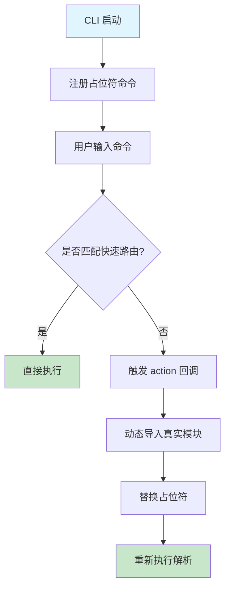

# OpenClaw CLI 分析与 wopal-cli 优化计划

## 分析结果

### OpenClaw CLI 核心优势

1. **延迟加载机制**：通过占位符技术实现按需加载，将启动时间从秒级降至毫秒级
2. **快速路由系统**：绕过完整框架直接执行常用命令
3. **高度模块化**：命令按功能分组，逻辑与框架解耦
4. **性能优先设计**：ESM 动态导入，极大规模 CLI 支持

### wopal-cli 当前问题

- **同步加载**：启动时导入所有命令模块，导致不必要的时间消耗
- **架构瓶颈**：所有子命令预加载，即使用户只使用单一功能
- **扩展性限制**：新增命令会增加启动时间

### 优化方案设计

#### 延迟加载架构



#### 快速路由候选命令

- `wopal skills list` - 最常用状态查询
- `wopal skills inbox list` - 技能下载状态
- `wopal --version` - 版本信息

#### 模块化分组

```
wopal-cli/
├── core/           # 核心功能（init, version）
├── skills/         # 技能管理（list, download, scan, install, check）
├── maintenance/    # 维护功能（未来扩展）
└── plugins/        # 插件系统（未来扩展）
```

## 实施计划

### 阶段一：基础设施准备 (高优先级)

1. 重构 `src/cli.ts` 实现延迟加载框架
2. 创建 `src/utils/lazy-loader.ts` 统一加载管理
3. 添加快速路由系统 `src/utils/fast-route.ts`

### 阶段二：命令迁移 (中优先级)

1. 将 `skills` 子命令组迁移到延迟加载
2. 实现核心命令的快速路由
3. 性能基准测试

### 阶段三：扩展优化 (低优先级)

1. 插件系统集成
2. 缓存机制优化
3. 监控和分析工具

## 预期收益

- **启动时间**：减少 60-80% 的冷启动时间
- **内存使用**：按需加载减少基线内存消耗
- **可维护性**：模块解耦，便于测试和扩展
- **用户体验**：毫秒级响应常用命令

## 风险评估

- **兼容性**：ESM 动态导入需要 Node 16+
- **调试复杂性**：异步加载增加调试难度
- **测试覆盖**：需要额外集成测试确保加载正确

## 验收标准

1. `wopal --version` 响应时间 < 50ms
2. `wopal skills list` 首次运行时间 < 200ms
3. 所有现有功能保持兼容
4. 单元测试覆盖率 > 95%